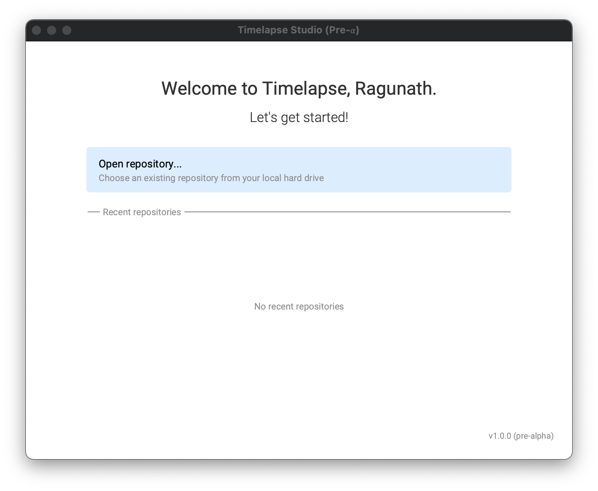

# Timelapse

Timelapse onboards developers onto codebases before you make that cup of instant noodles!

## Project setup

### Step 1 of 3 - Clone

The repository has submodules. If you haven't cloned the repository already, run:

```shell
git clone --recursive git@github.com:redgreenio/timelapse.git
```

If you have already cloned the repository without the `--recursive` option. Then `cd` into the project directory and
then run,

```shell
git submodule update --init --recursive
```

### Step 2 of 3 - Verify & run

`cd` into the project directory and run the following Gradle tasks.

**Windows**

```shell
gradlew test run
```

**Linux & macOS**

```shell
./gradlew test run
```

If the build succeeds, you should be able to see this screen!



### Step 3 of 3 - Install Git hooks

**Windows**

```shell
gradlew installGitHooks
```

**Linux & macOS**

```shell
./gradlew installGitHooks
```

### ProGuard

Create a new directory inside the project directory for de-obfuscating ProGuard traces from production.

```shell
mkdir proguard-lab
```

## Creating a release

We use different formats of versioning for internal and public releases.

### Public releases

The application is versioned in the following format `[YYYY].[release-number]` for public releases. `[YYYY]` denotes the
current year. `[release-number]` is the publicly released build number in that year.

For example, the first public release for the year 2021 would be `2021.1`, the next release would be `2021.2` and so on.

### Internal releases

Internal releases are any releases that are not published to the masses. This includes but is not limited to alpha, beta,
and nightly releases. Internal releases have the following format - `[YYYY].[previous-release-number].[build-number]`.

For example, the first internal release for 2021 with no public releases would be `2021.0.1`. Each internal release will
increment its `build-number` by `1`. After publishing the first public version, the next internal release for
2021 will be `2021.1.1`.

In general, public releases drop the `build-number` and increment the `release-number`, (i.e.) if `2021.3.45` is the internal
release version, the public release will be `2021.4`.

### Step 1 of 3 - Update CHANGELOG

Underneath the `## [Unreleased]` section, add the version and date in the following format.

```md
## [version] - YYYY-MM-DD
```

Example,
```md
## [2021.0.1] - 2021-04-13
```

### Step 2 of 3 - Update version in code and buildscript

- `TimelapseApp.kt` - update `APP_VERSION` to reflect the current version.
- `app/build.gradle.kts` - update `version` to reflect the current version.
- Stage and commit all changes with the message `build: bump version for release`.

### Step 3 of 3 - Build native package

```shell
gradlew jpackageImage jpackage
```

This will create a distributable native installer (currently `.dmg`) for **macOS**. Windows and Linux distributions are
yet to be tested.

## Distribution

| Operating System | Native Builds | Auto-updates |   Format  |
|------------------|---------------|--------------|-----------|
| macOS            | ✅            | In-progress  | `.dmg`    |
| Windows          | ❌            | ❌           | `-`       |
| Linux            | ❌            | ❌           | `-`       |

## License

```
Copyright 2021 Red Green, Inc.
```
